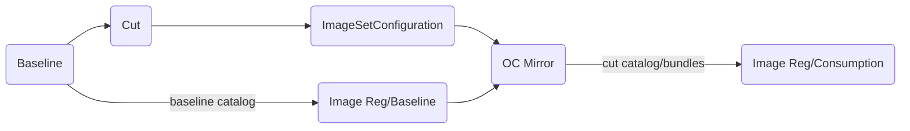

# Operator Baseline

Shell script focused tooling for front-end loading of Openshift index catalogs and operator images used in mirroring. Code covers only the _Baseline_, _Cut_ and _ImageSetConfiguration_ steps of the below workflow:



## Baseline and Cut New ImageSetConfiguration (ISC)

[![demo1]](https://github.com/user-attachments/assets/75e712bc-a85f-480e-a88a-ca5aec020dc9)

## Compare All packages ISC RedHat operators v4.16, v4.18

[![demo2]](https://github.com/user-attachments/assets/2b82e992-4b7f-4f10-b0e5-a5c87a745e05)


_baseline.sh_ is a convenience script for tagging and pushing an image that will serve as a baselined/datestamped copy [TARGET_CATALOG] of some cut generated ImageSetConfiguration.


> # cut.sh
>
> REPORT_LOCATION=baseline
>
> REPORT_LOCATION=$REPORT_LOCATION POD_RUNNER=/usr/bin/docker GEN_ISC=1 ./scripts/cut.sh $DATESTAMP $CATALOG_LOCATION pullspec/json1
> ...

```

_See also [cut.sh](./scripts/cut.sh)_

## Requires

sed  
[grpcurl](https://github.com/fullstorydev/grpcurl)  
jq  
find
[yq](https://github.com/mikefarah/yq)  
podman or docker


# WorkFlow

## Baseline

 CATALOG_NAMES = redhat certified community

 For each CATALOG_NAME in CATALOG_NAMES:

   a) pull and tag current upstream index for the new cut <CATALOG_LOCATION>[/<CATALOG_NAME>:<VERSION>]

   b) push the <CATALOG_LOCATION>[/<CATALOG_NAME>:<VERSION>] into target registry <sup>1</sup>

<sup>1</sup> Any future consumption activity on the catalog is out of scope for [operator_cut](https://github.com/damobrisbane/operator_cut).

_See also [baseline.sh](./scripts/baseline.sh)_

## Ex. Cut

## Ex. Target as Baseline

Run cut.sh with TARGET_AS_BASELINE=1. Note _catalog_, _targetName_ and _targetTag_ in the resulting ISC.

```
 TARGET_AS_BASELINE=1 TEMPLATE=isc-operator-v1.json GEN_ISC=1 ./scripts/cut.sh $D1 reg.dmz.lan/baseline cutspecs/kubevirt_v4.16

...
kind: ImageSetConfiguration
apiVersion: mirror.openshift.io/v1alpha2
archiveSize: null
storageConfig:
  registry:
    imageURL: reg.dmz.lan/metadata/20250715/redhat-operator-index:v4.16-cut
    skipTLS: false
mirror:
  operators:
    - catalog: reg.dmz.lan/baseline/20250715/redhat-operator-index:v4.16
      targetName: reg.dmz.lan/baseline/20250715/redhat-operator-index
      targetTag: v4.16-cut
      packages:
        - name: advanced-cluster-management
          channels:

```      


