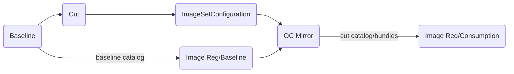
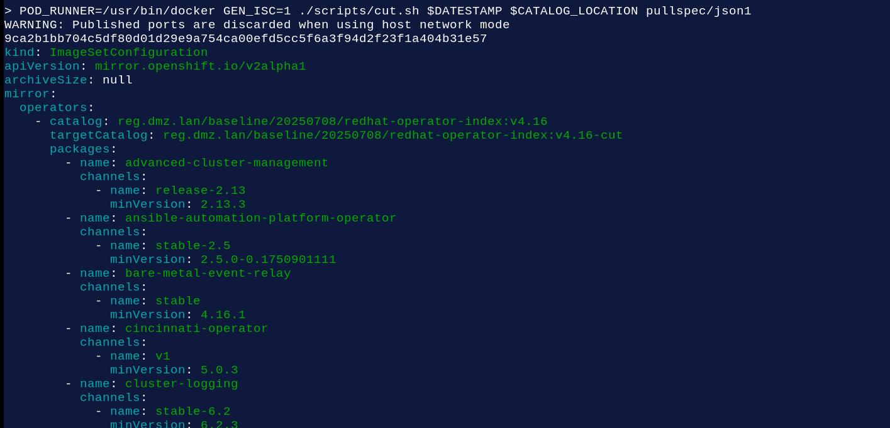

# Operator Baseline

Shell script focused tooling for front-end loading of Openshift index catalogs and operator images used in mirroring. Code covers only the _Baseline_, _Cut_ and _ImageSetConfiguration_ steps of the below workflow:



Syntax for [baseline](./scripts/baseline.sh) and [cut](./scripts/cut.sh) is similar and when cutting a new baseline they should share the same _pullspec_ folder over the scripts execution.

```

> # baseline.sh
>
> DATESTAMP=20250707
> CATALOG_LOCATION=reg.dmz.lan/baseline
>
> POD_RUNNER=/usr/bin/docker ./scripts/baseline.sh $DATESTAMP $CATALOG_LOCATION pullspec/json1

Image reg.dmz.lan/baseline/20250707/redhat-operator-index:v4.16 already exists, not downloading again..
Tagging reg.dmz.lan/baseline/20250707/redhat-operator-index:v4.16


> # cut.sh
>
> POD_RUNNER=/usr/bin/docker GEN_ISC=1 ./scripts/cut.sh $DATESTAMP $CATALOG_LOCATION pullspec/json1
> ...

```

The two scripts above would produce an ImageSetConfiguration such as:



## Requires

sed  
[grpcurl](https://github.com/fullstorydev/grpcurl)  
jq  
nc
[yq](https://github.com/mikefarah/yq)  
podman or docker

# Rationale 

Useful for disconnected environments with a need to cut operators on "minVersion" and consume the associated catalog indexes, independently of any upstream catalog updates. See [Creating the image set configuration](https://docs.redhat.com/en/documentation/openshift_container_platform/4.18/html/disconnected_environments/mirroring-in-disconnected-environments#oc-mirror-building-image-set-config-v2_about-installing-oc-mirror-v2).

Given an input pullspecs, output catalog operators, channels and versions. May optionally include operator bundle image references, or output an ImageSetConfiguration (ISC). A "pullspec" is a list of operators/catalog packages, where the only requirement is the package name. 

For an ISC, accept json or yaml for both input and output (eg [Global Parameters](./scripts/cut.sh) ). 

# Pull Specs

An input pullspec is configured as a folder path that potentially contains pullspecs for redhat, certified and community operators. Optionally include a list of channels. The default channel will be determined from a grpc catalog query and included in the output, regardless of whether it was specified or not (hence an empty list of channels for a given package still produces a viable "defaultChannel" output. 

Other fields such as defaultChannelName or [channel] csvName can exist in the pullspec for a package, but these fields will be ignored. This behaviour guarrantees accuracy ie of channel versions and default channels against a cutd index over any on-disk specs that may lag a new mirroring operation (ie see [Pre-Work](#Pre-Work)).

_The name of a pullspec file is implicitly used as catalog index name and tag in the code. ie \_redhat-operator-index-v4.16\_ becomes [catalog name] \_redhat-operator-index\_ and [tag] \_v4.16\_. The catalog and tag names need to also align with the locally run index image that is used in grpc queries._

_See also [cut.sh](./scripts/cut.sh)_

# WorkFlow

## Baseline

 CATALOG_NAMES = redhat certified community

 For each CATALOG_NAME in CATALOG_NAMES:

   a) pull and tag current upstream index for the new cut <CATALOG_LOCATION>[/<CATALOG_NAME>:<VERSION>]

   b) push the <CATALOG_LOCATION>[/<CATALOG_NAME>:<VERSION>] into target registry <sup>1</sup>

<sup>1</sup> Any future consumption activity on the catalog is out of scope for [operator_cut](https://github.com/damobrisbane/operator_cut).

_See also [baseline.sh](./scripts/baseline.sh)_

## Cut

Given an image name:

```
> podman ps:
> reg.dmz.lan/cut/20250701/certified-operator-index   v4.16     c85077a313ec   9 hours ago     1.5GB
```

Run script on PULLSPEC_DIR, which expects _Pre-Work_ to have been completed:

```     
> DATESTAMP=$(date +%Y%m%d)
> CATALOG_LOCATION=reg.dmz.lan/cut/$DATESTAMP
> cls;GEN_ISC=1 ./files/common/cut.sh $DATESTAMP $CATALOG_LOCATION $PULLSPEC_DIR
```
where PULLSPEC_DIR is the root folder containing spec files for operator mirroring specs (yaml or json)

Where CATALOG_LOCATION is BOTH a grpc location and a destination registry location

Generate an ISC CatalogName of _reg.dmz.lan/cut/20250704/redat-operator-index:v4.16_

## Consume

Consume the cut ImageSetConfiguration, where its _CatalogName_ should align with <CATALOG_LOCATION>[/<CATALOG_NAME>:<VERSION>] of the baseline. CATLOG_NAME should correspond to the pullspec file name, refer code:

```
_CATALOG_NAME=${_FN_PULLSPEC%.*}
```

## Container Images to script execution, to registry location mapping


## BUNDLE parameter

Running with BUNDLE=1 gives bundle image in the output:

```
> BUNDLE=1 FORMATS=json ./scripts/cut.sh $DATESTAMP $CATALOG_LOCATION pullspec/json1

...


[
  {
    "name": "advanced-cluster-management",
    "defaultChannelName": "release-2.13",
    "channels": [
      {
        "name": "release-2.13",
        "csvName": "advanced-cluster-management.v2.13.3",
        "version": "2.13.3",
        "bundlePath": "registry.redhat.io/rhacm2/acm-operator-bundle@sha256:be468395c00c323b013c14f535472f5d7f49b9ed36fba2645ff102eaf99b197e"
      }
    ]
  },
  {
    "name": "ansible-automation-platform-operator",
    "defaultChannelName": "stable-2.5",
    "channels": [
      {
        "name": "stable-2.5",
        "csvName": "aap-operator.v2.5.0-0.1750901111",
        "version": "2.5.0-0.1750901111",
        "bundlePath": "registry.redhat.io/ansible-automation-platform/platform-operator-bundle@sha256:bcd18a86b1ca2f62177bb66a72ec2a4fcd58b49411635e3b725c4b934e59ee2e"
      }
    ]
  },
  {
...

```

## Generating a new cut

Can imagine other approaches available for this (TBD link(s)), however you could also [after baseline] run [cut.sh](./scripts/cut.sh), _without the GEN_ISC parameter_, and then tweak the generated files:

```
> mkdir tmp; touch tmp/{redhat,certified,community}-operator-index-v4.16.ndjson

> REPORT_LOCATION=pullspec/MYNEWSPEC ALL_PKGS=1 FORMATS=json ./scripts/cut.sh $DATESTAMP $CATALOG_LOCATION tmp

> find pullspec/MYNEWSPEC/
pullspec/MYNEWSPEC/
pullspec/MYNEWSPEC/20250705
pullspec/MYNEWSPEC/20250705/certified-operator-index.isc-json
pullspec/MYNEWSPEC/20250705/community-operator-index.isc-json
pullspec/MYNEWSPEC/20250705/redhat-operator-index.isc-json

> head pullspec/MYNEWSPEC/20250705/redhat-operator-index.isc-json
[
  {
    "name": "3scale-operator",
    "channels": [
      {
        "name": "threescale-mas",
        "minVersion": "0.12.1-mas"
      },
      {
        "name": "threescale-2.15",


```


## TBD

Versioning, see comment under _Limitations caveats_, in [cut.sh](./scripts/cut.sh)

Incorporate the _additionalImages_ in a pullspec [and a generated ISC].
