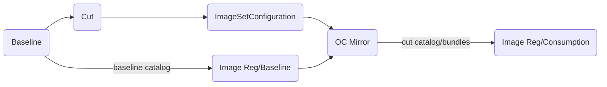

# Operator Baseline

Shell script focused tooling for front-end loading of Openshift index catalogs and operator images used in mirroring. Code covers only the _Baseline_, _Cut_ and _ImageSetConfiguration_ steps of the below workflow:

## Terminology

A challenge with the operator mirroring process and ImageSetConfigurations (ISC) generally, is that an ISC is a static artifact which can contain references to specific operator channels and versions, but the catalog that it is defined against is a constantly moving target. So a specific operator/channel/version may be accurate at the time creation, but becomes inaccurate - and breaks - when running oc-mirror on that same ISC a day later. The concept of a baseline is a point-in-time reference to an operator catalog, all operators, channels and versions are fixed against this baseline. A _cut_ is a specific subset of the baseline, eg. maybe only specifying four or five operators to mirror. The difference being, any specific operator/channel/versions defined in an ISC will remain consistent on subsequent [cut] runs of oc-mirror against that _baseline catalog_. 




## Baseline and Cut New ImageSetConfiguration (ISC)

[![demo1]](https://github.com/user-attachments/assets/75e712bc-a85f-480e-a88a-ca5aec020dc9)

## Compare All packages ISC RedHat operators v4.16, v4.18

[![demo2]](https://github.com/user-attachments/assets/2b82e992-4b7f-4f10-b0e5-a5c87a745e05)


## Requires

podman
[grpcurl](https://github.com/fullstorydev/grpcurl)  
jq  
[yq](https://github.com/mikefarah/yq)  
sed  
find

# WorkFlow

## CutSpecs

Refer examples in the _cutspecs_ folder. Opinionated ndjson, yaml formats. Will always return the default channel (and _minVersion_) whether specified or not.

## OC Mirror v2

Run _cut.sh_ with an appropriate TEMPLATE=\<v2 template\> global parameter. See examples in the [template dir](./scripts/template).

## Baseline

_baseline.sh_ is a convenience script for tagging and pushing an image that will serve as a baselined/datestamped copy [TARGET_CATALOG] of some cut generated ImageSetConfiguration.

 CATALOG_NAMES = whatever is in a cutspec, at lease redhat certified community catalogs

 For each CATALOG_NAME in CATALOG_NAMES:

   a) pull and tag current upstream index for the new cut \<REG_LOCATION\>/\<DATESTAMP\>/\<NAMETAG\><sup>1</sup>

   b) push the \<REG_LOCATION\>/\<DATESTAMP\>/\<NAMETAG\> into target registry <sup>1</sup>

<sup>1</sup> Not to be confused with \<REG_LOCATION\>/\<DATESTAMP\>/\<NAMETAG\>**-cut**, which is a specific catalog image that results from running the oc_mirror process, as per <sup>2</sup> - out of scope. [operator_baseline](https://github.com/damobrisbane/operator_baseline) produces an ISC with the "-cut" catalog spec which is input for a future run of _oc_mirror_, wherein the image artefacts will get actually get downloaded.

<sup>2</sup> Consumption, future use of the baselined catalog is out of scope for [operator_baseline](https://github.com/damobrisbane/operator_baseline).

_See also [baseline.sh](./scripts/baseline.sh)_

## Cut

```
# cut.sh

REPORT_LOCATION=baseline

TEMPLATE=isc-operator-v1.json SKIP_POD_RM=1 GEN_ISC=1 ./scripts/cut.sh 20250715 reg.dmz.lan/baseline cutspecs/kubevirt_v4.16
...
kind: ImageSetConfiguration
apiVersion: mirror.openshift.io/v1alpha2
archiveSize: null
storageConfig:
  registry:
    imageURL: reg.dmz.lan/metadata/20250715/redhat-operator-index:v4.16-cut
    skipTLS: false
mirror:
  operators:
    - catalog: registry.redhat.io/redhat/redhat-operator-index:v4.16
      targetName: reg.dmz.lan/baseline/20250715/redhat-operator-index
      targetTag: v4.16-cut
      packages:
        - name: advanced-cluster-management
          channels:
            - name: release-2.12
              minVersion: 2.12.3
            - name: release-2.13
              minVersion: 2.13.3
        - name: ansible-automation-platform-operator
          channels:
            - name: stable-2.5
              minVersion: 2.5.0+0.1750901111
        - name: bare-metal-event-relay
          channels:

...
```

Note only ACM has more than one channel, the rest (unspecified) are all defaults [isc-redhat-operator-index-v4.16-cut.yaml](./baseline/20250715/isc-redhat-operator-index-v4.16-cut.yaml).

_See also [cut.sh](./scripts/cut.sh)_


## Ex. 1) Target as Baseline.

Run cut.sh with TARGET_AS_BASELINE=1. Note _catalog_, _targetName_ and _targetTag_ in the resulting ISC.

```

> cat cutspecs/kubevirt_v4.16/redhat-operator-index-v4.16.yml
oc_mirror_operators:
  - catalog: registry.redhat.io/redhat/redhat-operator-index:v4.16
    packages:
      - name: advanced-cluster-management
        channels:
          - name: release-2.12
            minVersion: '2.12.2'
      - name: ansible-automation-platform-operator
      - name: bare-metal-event-relay
      - name: cincinnati-operator
      - name: cluster-logging
      - name: cluster-kube-descheduler-operator
      - name: compliance-operator
      - name: devspaces
      - name: devworkspace-operator
      - name: kubevirt-hyperconverged
      - name: mcg-operator
      - name: ocs-operator
      - name: odf-multicluster-orchestrator
      - name: odf-operator
      - name: odr-cluster-operator
      - name: odr-hub-operator
      - name: openshift-custom-metrics-autoscaler-operator
      - name: openshift-gitops-operator
      - name: opentelemetry-product
>

TARGET_AS_BASELINE=1 TEMPLATE=isc-operator-v1.json SKIP_POD_RM=1 GEN_ISC=1 ./scripts/cut.sh target_baseline_20250715 reg.dmz.lan/baseline cutspecs/kubevirt_v4.16

...
kind: ImageSetConfiguration
apiVersion: mirror.openshift.io/v1alpha2
archiveSize: null
storageConfig:
  registry:
    imageURL: reg.dmz.lan/metadata/20250715/redhat-operator-index:v4.16-cut
    skipTLS: false
mirror:
  operators:
    - catalog: reg.dmz.lan/baseline/20250715/redhat-operator-index:v4.16
      targetName: reg.dmz.lan/baseline/20250715/redhat-operator-index
      targetTag: v4.16-cut
      packages:
        - name: advanced-cluster-management
          channels:

...

```      

## Ex. 2) ALL_PKGS, Minimal Spec

Run cut.sh with ALL_PKGS=1. Note the minimal specs with no packages needed.

```

> cat cutspecs/minimal_specs_20250709/redhat-operator-indexes.json 
{
  "catalog_baseline": "reg.dmz.lan/baseline/20250709/redhat-operator-index:v4.16",
  "packages_cut": []
}
{
  "catalog_baseline": "reg.dmz.lan/baseline/20250709/redhat-operator-index:v4.18",
  "packages_cut": []
}

> DEBUG=1 ALL_PKGS=1 GEN_ISC=1 SKIP_POD_RM=1 ./scripts/cut.sh 20250715 reg.dmz.lan/baseline cutspecs/minimal_specs_20250709

(cut.sh) _f_main $_J_CUTSPEC 20250715 reg.dmz.lan/baseline/20250709/redhat-operator-index:v4.16 reg.dmz.lan/baseline/20250715/redhat-operator-index:v4.16-cut
(cut.sh:f_main) gen_isc _J_PKGS_CUT reg.dmz.lan/baseline/20250709/redhat-operator-index:v4.16 reg.dmz.lan/baseline/20250715/redhat-operator-index:v4.16-cut
(cut.sh:f_main) _f_output_isc _J_ISC 20250715 redhat-operator-index v4.16-cut

...
kind: ImageSetConfiguration
apiVersion: mirror.openshift.io/v2alpha1
archiveSize: null
mirror:
  operators:
    - catalog: reg.dmz.lan/baseline/20250709/redhat-operator-index:v4.16
      targetCatalog: reg.dmz.lan/baseline/20250715/redhat-operator-index
      targetTag: v4.16-cut
      packages:
        - name: 3scale-operator
          channels:
            - name: threescale-mas
              minVersion: 0.12.1-mas
            - name: threescale-2.15
              minVersion: 0.12.3
            - name: threescale-2.14
              minVersion: 0.11.13
        - name: advanced-cluster-management
          channels:
            - name: release-2.12
              minVersion: 2.12.3
            - name: release-2.13
              minVersion: 2.13.3
            - name: release-2.10
              minVersion: 2.10.8
            - name: release-2.11
              minVersion: 2.11.7
        - name: amq-broker-rhel8
          channels:
            - name: 7.12.x
...

(cut.sh) _f_main $_J_CUTSPEC 20250715 reg.dmz.lan/baseline/20250709/redhat-operator-index:v4.18 reg.dmz.lan/baseline/20250715/redhat-operator-index:v4.18-cut
(cut.sh:f_main) gen_isc _J_PKGS_CUT reg.dmz.lan/baseline/20250709/redhat-operator-index:v4.18 reg.dmz.lan/baseline/20250715/redhat-operator-index:v4.18-cut
(cut.sh:f_main) _f_output_isc _J_ISC 20250715 redhat-operator-index v4.18-cut
kind: ImageSetConfiguration
apiVersion: mirror.openshift.io/v2alpha1
archiveSize: null
mirror:
  operators:
    - catalog: reg.dmz.lan/baseline/20250709/redhat-operator-index:v4.18
      targetCatalog: reg.dmz.lan/baseline/20250715/redhat-operator-index
      targetTag: v4.18-cut
      packages:
        - name: 3scale-operator
          channels:
            - name: threescale-mas
              minVersion: 0.11.8-mas
            - name: threescale-2.15
              minVersion: 0.12.3
            - name: threescale-2.13
              minVersion: 0.10.5
        - name: advanced-cluster-management
          channels:
            - name: release-2.12
              minVersion: 2.12.3
            - name: release-2.13
              minVersion: 2.13.3
        - name: amq-broker-rhel8
          channels:
            - name: 7.12.x
              minVersion: 7.12.4-opr-1+0.1747217191.p
            - name: 7.10.x
              minVersion: 7.10.7-opr-1
            - name: 7.11.x
              minVersion: 7.11.8-opr-1
        - name: amq-broker-rhel9
          channels:

> find baseline -mmin -1
baseline/20250715
baseline/20250715/isc-redhat-operator-index-v4.16-cut.yaml
baseline/20250715/isc-redhat-operator-index-v4.18-cut.yaml
> 
```

# TBD

## v0.1

Fix gnarly code around package/channels

## v0.2

Fix running index labelling, ports for all catalogs
Update templating to allow passthrough on standard ISC fields (along with allowing thoses fields - platform, additionalimages) to be present in cutspecs.
