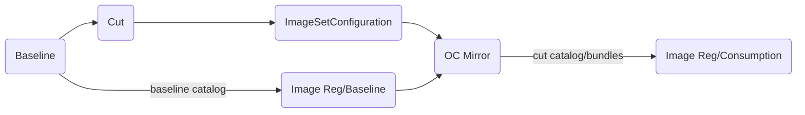

# Operator Baseline

Shell script focused tooling for front-end loading of Openshift index catalogs and operator images used in mirroring. Code covers only the _Baseline_, _Cut_ and _ImageSetConfiguration_ steps of the below workflow:



_baseline.sh_ is a convenience script for tagging and pushing an image that will serve as a baselined/datestamped copy [TARGET_CATALOG] of some cut generated ImageSetConfiguration.


> # cut.sh
>
> REPORT_LOCATION=baseline
>
> REPORT_LOCATION=$REPORT_LOCATION POD_RUNNER=/usr/bin/docker GEN_ISC=1 ./scripts/cut.sh $DATESTAMP $CATALOG_LOCATION pullspec/json1
> ...

```

_See also [cut.sh](./scripts/cut.sh)_

## Requires

sed  
[grpcurl](https://github.com/fullstorydev/grpcurl)  
jq  
find
[yq](https://github.com/mikefarah/yq)  
podman or docker


# WorkFlow

## Baseline

 CATALOG_NAMES = redhat certified community

 For each CATALOG_NAME in CATALOG_NAMES:

   a) pull and tag current upstream index for the new cut <CATALOG_LOCATION>[/<CATALOG_NAME>:<VERSION>]

   b) push the <CATALOG_LOCATION>[/<CATALOG_NAME>:<VERSION>] into target registry <sup>1</sup>

<sup>1</sup> Any future consumption activity on the catalog is out of scope for [operator_cut](https://github.com/damobrisbane/operator_cut).

_See also [baseline.sh](./scripts/baseline.sh)_

## Cut

Given an image name:

```
> podman ps:
> reg.dmz.lan/cut/20250701/certified-operator-index   v4.16     c85077a313ec   9 hours ago     1.5GB
```

Run script on PULLSPEC_DIR, which expects _Pre-Work_ to have been completed:

```     
> DATESTAMP=$(date +%Y%m%d)
> CATALOG_LOCATION=reg.dmz.lan/cut/$DATESTAMP
> cls;GEN_ISC=1 ./files/common/cut.sh $DATESTAMP $CATALOG_LOCATION $PULLSPEC_DIR
```
where PULLSPEC_DIR is the root folder containing spec files for operator mirroring specs (yaml or json)

Where CATALOG_LOCATION is BOTH a grpc location and a destination registry location

Generate an ISC CatalogName of _reg.dmz.lan/cut/20250704/redat-operator-index:v4.16_

## Consume

Consume the cut ImageSetConfiguration, and if baselined prior to cut, the _targetCatalog_ should align with the <CATALOG_LOCATION>[/<CATALOG_NAME>:<VERSION>-cut] tag generated in _baseline.sh_.


## TBD

Versioning, see comment under _Limitations caveats_, in [cut.sh](./scripts/cut.sh)

Incorporate the _additionalImages_ in a pullspec [and a generated ISC].
