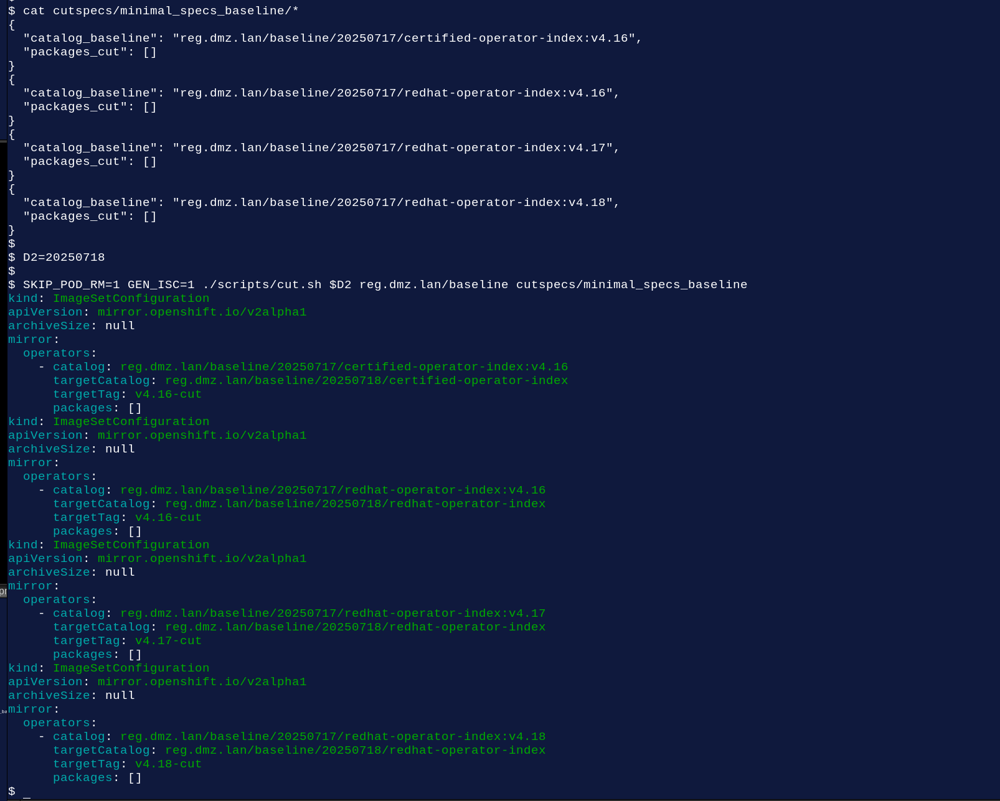

# minimal_specs_baseline

## Repeat Baseline (no change)

Run baseline.sh on pre-existing images, dont pull down, dont push.

D1=20250717
SKIP_PUSH=1 SKIP_IMAGE_RM=1 ./scripts/baseline.sh $D1 reg.dmz.lan/baseline cutspecs/minimal_specs_baseline/

```

$ SKIP_PUSH=1 SKIP_IMAGE_RM=1 ./scripts/baseline.sh $D1 reg.dmz.lan/baseline cutspecs/minimal_specs_baseline/

Image reg.dmz.lan/baseline/20250717/certified-operator-index:v4.16 already exists, not downloading again..
Tagging reg.dmz.lan/baseline/20250717/certified-operator-index:v4.16 reg.dmz.lan/baseline/20250717/certified-operator-index:v4.16
Image reg.dmz.lan/baseline/20250717/redhat-operator-index:v4.16 already exists, not downloading again..
Tagging reg.dmz.lan/baseline/20250717/redhat-operator-index:v4.16 reg.dmz.lan/baseline/20250717/redhat-operator-index:v4.16
Image reg.dmz.lan/baseline/20250717/redhat-operator-index:v4.17 already exists, not downloading again..
Tagging reg.dmz.lan/baseline/20250717/redhat-operator-index:v4.17 reg.dmz.lan/baseline/20250717/redhat-operator-index:v4.17
Image reg.dmz.lan/baseline/20250717/redhat-operator-index:v4.18 already exists, not downloading again..
Tagging reg.dmz.lan/baseline/20250717/redhat-operator-index:v4.18 reg.dmz.lan/baseline/20250717/redhat-operator-index:v4.18

```

## Re-Baseline




# cross-validation3

Simple template, GEN_ISC=1 (effectively yaml). Suitable for vim-like diffs

> GEN_ISC=1 ALL_CHNLS=1 TEMPLATE=isc-operator-diff.json SKIP_POD_RM=1 ./scripts/cut.sh cross-validation3 reg.dmz.lan/baseline cutspecs/cross_validation3

```
catalog: registry.redhat.io/redhat/redhat-operator-index:v4.16
packages:
  - name: 3scale-operator
    channels:
      - name: threescale-2.15
        minVersion: 0.12.3
      - name: threescale-mas
        minVersion: 0.12.1-mas
      - name: threescale-2.14
        minVersion: 0.11.13
  - name: apicast-operator
    channels:
      - name: threescale-2.15
        minVersion: 0.12.3
      - name: threescale-mas
        minVersion: 0.12.1-mas
      - name: threescale-2.14
        minVersion: 0.8.3
      - name: threescale-2.13
        minVersion: 0.7.5
      - name: threescale-2.12
        minVersion: 0.6.4
      - name: threescale-2.11
        minVersion: 0.5.3
  - name: costmanagement-metrics-operator
    channels:
      - name: stable
        minVersion: 3.3.2
  - name: mtc-operator
    channels:
      - name: release-v1.8
        minVersion: 1.8.8
      - name: release-v1.7
        minVersion: 1.7.19
  - name: red-hat-camel-k
    channels:
      - name: 1.10.x
        minVersion: 1.10.10
      - name: 1.6.x
        minVersion: 1.6.10
      - name: 1.4.x
        minVersion: 1.4.2
      - name: latest
        minVersion: 1.10.10
      - name: stable
        minVersion: 1.6.10
      - name: 1.8.x
        minVersion: 1.8.2+0.1675913507.p
      - name: candidate
        minVersion: 1.10.10
  - name: self-node-remediation
    channels:
      - name: stable
        minVersion: 0.10.2
      - name: 4.14-eus
        minVersion: 0.7.1
      - name: 4.16-eus
        minVersion: 0.9.1
      - name: 4.18-eus
        minVersion: 0.10.2
      - name: 4.12-eus
        minVersion: 0.5.1
catalog: registry.redhat.io/redhat/redhat-operator-index:v4.18
packages:
  - name: 3scale-operator
    channels:
      - name: threescale-2.15
        minVersion: 0.12.3
      - name: threescale-mas
        minVersion: 0.11.8-mas
      - name: threescale-2.13
        minVersion: 0.10.5
  - name: apicast-operator
    channels:
      - name: threescale-2.15
        minVersion: 0.12.3
      - name: threescale-mas
        minVersion: 0.7.9-mas
      - name: threescale-2.14
        minVersion: 0.8.1
      - name: threescale-2.13
        minVersion: 0.7.5
      - name: threescale-2.12
        minVersion: 0.6.4
      - name: threescale-2.11
        minVersion: 0.5.3
  - name: costmanagement-metrics-operator
    channels:
      - name: stable
        minVersion: 3.3.1
  - name: mtc-operator
    channels:
      - name: release-v1.8
        minVersion: 1.8.8
      - name: release-v1.7
        minVersion: 1.7.17
  - name: red-hat-camel-k
    channels:
      - name: 1.10.x
        minVersion: 1.10.8+0.1733993735.p
      - name: 1.6.x
        minVersion: 1.6.10
      - name: 1.4.x
        minVersion: 1.4.2
      - name: latest
        minVersion: 1.10.8+0.1733993735.p
      - name: stable
        minVersion: 1.6.10
      - name: 1.8.x
        minVersion: 1.8.2+0.1675913507.p
      - name: candidate
        minVersion: 1.10.8+0.1733993735.p
  - name: self-node-remediation
    channels:
      - name: stable
        minVersion: 0.10.2
      - name: 4.14-eus
        minVersion: 0.7.1
      - name: 4.16-eus
        minVersion: 0.9.0
      - name: 4.18-eus
        minVersion: 0.10.2
      - name: 4.12-eus
        minVersion: 0.5.1
catalog: registry.redhat.io/redhat/redhat-operator-index:v4.19
packages:
  - name: 3scale-operator
    channels:
      - name: threescale-2.13
        minVersion: 0.10.5
      - name: threescale-mas
        minVersion: 0.11.8-mas
  - name: apicast-operator
    channels:
      - name: threescale-2.14
        minVersion: 0.8.1
      - name: threescale-mas
        minVersion: 0.7.9-mas
      - name: threescale-2.13
        minVersion: 0.7.5
      - name: threescale-2.12
        minVersion: 0.6.4
      - name: threescale-2.11
        minVersion: 0.5.3
  - name: costmanagement-metrics-operator
    channels:
      - name: stable
        minVersion: 3.3.1
  - name: mtc-operator
    channels:
      - name: release-v1.8
        minVersion: 1.8.8
      - name: release-v1.7
        minVersion: 1.7.17
  - name: red-hat-camel-k
    channels:
      - name: 1.10.x
        minVersion: 1.10.8+0.1733993735.p
      - name: 1.6.x
        minVersion: 1.6.10
      - name: 1.4.x
        minVersion: 1.4.2
      - name: latest
        minVersion: 1.10.8+0.1733993735.p
      - name: stable
        minVersion: 1.6.10
      - name: 1.8.x
        minVersion: 1.8.2+0.1675913507.p
      - name: candidate
        minVersion: 1.10.8+0.1733993735.p
  - name: self-node-remediation
    channels:
      - name: stable
        minVersion: 0.10.2
      - name: 4.14-eus
        minVersion: 0.7.1
      - name: 4.16-eus
        minVersion: 0.9.0
      - name: 4.18-eus
        minVersion: 0.10.2
      - name: 4.12-eus
        minVersion: 0.5.1

```

> find baseline -mmin -1

```
baseline
baseline/cross-validation3
baseline/cross-validation3/isc-redhat-operator-index-v4.16-cut.yaml
```
baseline/cross-validation3/isc-redhat-operator-index-v4.18-cut.yaml
baseline/cross-validation3/isc-redhat-operator-index-v4.19-cut.yaml

# ie diff

vim -O -d baseline/cross-valdation3/*


# Light-speed

Generate bundle and image references for selected package.


> GRPC_IMAGES=1 GEN_API=1 SKIP_POD_RM=1 ./scripts/cut.sh lightspeed reg.dmz.lan/baseline cutspecs/light-speed-v4.17

```
{
  "catalog": "registry.redhat.io/redhat/redhat-operator-index:v4.17",
  "packages": [
    {
      "name": "lightspeed-operator",
      "defaultChannelName": "stable",
      "channels": [
        {
          "name": "stable",
          "minVersion": "1.0.1",
          "bundlePath": "registry.redhat.io/openshift-lightspeed/lightspeed-operator-bundle@sha256:6d8f277d735816b0263202ea7213869a724d2e7400c82807927ddcefb236a72c",
          "relatedImages": [
            "registry.redhat.io/openshift-lightspeed/lightspeed-service-api-rhel9@sha256:2b9c0462a2453f85b3cc03339135a6dc77ceb417d89b7f671d1aac18582058ca",
            "registry.redhat.io/openshift-lightspeed/lightspeed-console-plugin-rhel9@sha256:854ce0b95b52f39fa396ece7304bc20c6427bcf9da89d14686e5eda578d14741",
            "registry.redhat.io/openshift-lightspeed/lightspeed-rhel9-operator@sha256:965d739b00a1f9b11163c5826228ca916e6e8dba228a39f03809437d88bf267e",
            "registry.redhat.io/openshift-lightspeed/lightspeed-operator-bundle@sha256:6d8f277d735816b0263202ea7213869a724d2e7400c82807927ddcefb236a72c"
          ]
        }
      ]
    }
  ]
}
```

> podman pull registry.redhat.io/openshift-lightspeed/lightspeed-service-api-rhel9@sha256:2b9c0462a2453f85b3cc03339135a6dc77ceb417d89b7f671d1aac18582058ca

```
Trying to pull registry.redhat.io/openshift-lightspeed/lightspeed-service-api-rhel9@sha256:2b9c0462a2453f85b3cc03339135a6dc77ceb417d89b7f671d1aac18582058ca...
Getting image source signatures
Copying blob 9e0c739abd58 skipped: already exists  
Copying blob 1ec5864c3611 skipped: already exists  
Copying config fa4a2026ed done   | 
Writing manifest to image destination
fa4a2026ed4c7ea2fd39a3ddfcbc0800242900d2de118f60ed2a06c86affb107
> 
```

> podman tag registry.redhat.io/openshift-lightspeed/lightspeed-service-api-rhel9@sha256:2b9c0462a2453f85b3cc03339135a6dc77ceb417d89b7f671d1aac18582058ca reg.dmz.lan/openshift-lightspeed/lightspeed-service-api-rhel9
> 

> podman push reg.dmz.lan/openshift-lightspeed/lightspeed-service-api-rhel9

```
> podman push reg.dmz.lan/openshift-lightspeed/lightspeed-service-api-rhel9
Getting image source signatures
Copying blob 1ec5864c3611 skipped: already exists  
Copying blob 9e0c739abd58 skipped: already exists  
Copying config fa4a2026ed done   | 
Writing manifest to image destination
> 

```

> operator_baseline]$ find baseline -mmin -1

```
baseline
baseline/20250709/api-redhat-operator-index-v4.17-cut.json
```


# Simple Related Images

Run GEN_API=1, related images on self-node-remediation operator. Two runs, first defaults to stable channel, next all channels.

```

$ D2=simple_relatedimages

$ SKIP_POD_RM=1 TEMPLATE=simple_relatedimages.json GRPC_IMAGES=1 GEN_API=1 ./scripts/cut.sh $D2 reg.dmz.lan/baseline cutspecs/simple_relatedimages

$ ALL_CHNLS=1 SKIP_POD_RM=1 TEMPLATE=simple_relatedimages.json GRPC_IMAGES=1 GEN_API=1 ./scripts/cut.sh $D2 reg.dmz.lan/baseline cutspecs/simple_relatedimages

```


